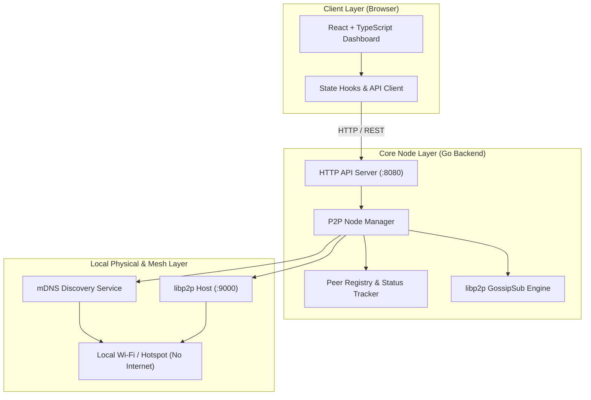

# AapdaSetu

## Offline Emergency Communication Mesh Network

AapdaSetu is a decentralized, offline-first peer-to-peer (P2P) emergency communication system designed for disaster scenarios where cellular networks, power grids, and internet infrastructure have collapsed.

By leveraging local network interfaces (Wi-Fi access points, ad-hoc networks, and mobile hotspots), AapdaSetu enables connected devices to automatically discover each other and form a resilient communication mesh without relying on centralized servers or external internet access.

---

## System Overview

In sudden disaster events such as earthquakes, floods, or cyclones, standard telecommunications infrastructure is often the first casualty. Cellular towers lose power or backhaul connectivity, leaving victims and emergency responders cut off from critical information channels.

AapdaSetu resolves this communication vacuum by providing:

1. **Zero-Internet Operation**: All node discovery, mesh networking, message relaying, and user interfaces execute entirely within local networks.
2. **Automatic Peer Discovery**: Devices announce their presence and discover nearby nodes across the local area network using multicast DNS (mDNS) without requiring manual configuration or IP entry.
3. **Decentralized Mesh Networking**: Powered by libp2p, nodes establish secure, multiplexed peer-to-peer connections and exchange messages via GossipSub pub/sub topics.
4. **Emergency Broadcasts**: Instantaneous distribution of high-priority SOS emergency notices to all reachable nodes in the local mesh.
5. **Decoupled Architecture**: A lightweight Go backend handles network operations and exposes a clean local REST API, while a responsive React frontend provides an intuitive emergency dashboard.
6. **Containerized Deployment**: Ready-to-deploy Docker configurations for rapid setup across laptops, portable edge nodes, and disaster response field kits.

---

## System Architecture

### Component Hierarchy



### Data Flow & Network Topology

```
+-----------------------------------------------------------------------+
|                           Local Area Network                          |
|                   (Wi-Fi Router or Mobile Hotspot)                    |
+-----------------------------------------------------------------------+
        ^                                   ^
        | mDNS Discovery                    | mDNS Discovery
        v                                   v
+-----------------------+           +-----------------------+
|     Device Node A     |           |     Device Node B     |
|                       |           |                       |
|  +-----------------+  |  libp2p   |  +-----------------+  |
|  |  React UI (:3000) | |  GossipSub|  |  React UI (:3000) | |
|  +--------+--------+  |  Mesh     |  +--------+--------+  |
|           | REST      | <=======> |           | REST      |
|  +--------v--------+  |  (:9000)  |  +--------v--------+  |
|  | Go Backend(:8080)| |           |  | Go Backend(:8080)| |
|  +-----------------+  |           |  +-----------------+  |
+-----------------------+           +-----------------------+
```

---

## How It Works

### 1. Node Initialization
When an AapdaSetu node launches, it starts a libp2p host bound to a configurable TCP port (default: 9000). A unique cryptographic Peer ID is generated for the node.

### 2. Automatic Peer Discovery (mDNS)
The node registers an mDNS discovery service using a shared rendezvous identifier (`aapdasetu-emergency-net`). It continuously broadcasts presence beacons on multicast address `224.0.0.251:5353` and listens for announcements from other AapdaSetu instances on the same subnet.

### 3. Mesh Formation
Upon discovering a peer, the node initiates an authenticated, multiplexed libp2p connection (using Noise encryption and Yamux multiplexing). The peer is added to the active peer registry.

### 4. Topic-Based Messaging (GossipSub)
Nodes subscribe to dedicated PubSub channels:
- `aapdasetu-chat`: Standard inter-node conversational communication and situational updates.
- `aapdasetu-alert`: High-priority SOS broadcasts forwarded across all peers in the mesh.

### 5. Local Frontend Integration
The Go backend exposes an HTTP REST server on port 8080. The React single-page application queries local status, retrieves message streams, and dispatches new messages through these endpoints without requiring external network connectivity.

---

## Technology Stack

| Layer | Component | Description |
|---|---|---|
| Core Backend | Go (Golang) | High-performance, concurrent network daemon with minimal memory footprint |
| P2P Protocols | libp2p (`go-libp2p`) | Modular peer-to-peer networking stack with encrypted transports and stream multiplexing |
| Discovery | mDNS (`p2p/discovery/mdns`) | Multicast DNS for zero-configuration LAN peer detection |
| Messaging | GossipSub (`go-libp2p-pubsub`) | Resilient, decentralized publish/subscribe messaging system |
| User Interface | React 18, TypeScript, Tailwind CSS | Fast, accessible emergency UI optimized for low latency and high contrast |
| Tooling & Packaging | Docker, Docker Compose | Multi-stage container builds for rapid deployment across various hardware targets |

---

## Repository Structure

```
AapdaSetu/
├── backend/
│   ├── cmd/
│   │   └── node/             # Application entrypoint (main.go)
│   ├── config/               # Configuration parser and CLI flag handlers
│   ├── internal/
│   │   ├── api/              # HTTP REST handlers, status models, and CORS
│   │   ├── p2p/              # libp2p host initialization and network handlers
│   │   ├── broadcast/        # Emergency broadcast message dispatch logic
│   │   └── peers/            # Peer state tracking and registry
│   ├── go.mod                # Go module specification
│   └── go.sum                # Cryptographic checksums of Go dependencies
├── frontend/
│   ├── public/               # Static assets
│   ├── src/
│   │   ├── components/       # Reusable UI modules (chat, peers, broadcast)
│   │   ├── services/         # Typed API client for backend communication
│   │   ├── types/            # TypeScript interfaces and schema declarations
│   │   ├── App.tsx           # Primary application layout and state coordination
│   │   ├── main.tsx          # React application root
│   │   └── index.css         # Tailwind utility styling
│   ├── package.json          # Node.js dependencies and lifecycle scripts
│   ├── tsconfig.json         # TypeScript compiler configuration
│   └── vite.config.ts        # Vite build tool and development server configuration
├── deployments/
│   └── docker/
│       ├── Dockerfile.backend    # Multi-stage Go static binary container
│       ├── Dockerfile.frontend   # React production build with Nginx reverse proxy
│       ├── nginx.conf            # Nginx routing configuration
│       └── docker-compose.yml    # Unified multi-service deployment spec
├── scripts/
│   └── run-dev.sh            # Background process runner for local development
├── start.sh                  # Root one-click initialization script
└── README.md                 # Project documentation
```

---

## API Specification

The core node exposes the following local endpoints:

### Health Check
- **Endpoint**: `GET /api/health`
- **Description**: Returns basic operational status of the HTTP listener.
- **Response**:
  ```json
  {
    "status": "ok",
    "time": "2026-09-23T01:54:07Z"
  }
  ```

### Node Status
- **Endpoint**: `GET /api/status`
- **Description**: Returns local node metadata, operational ports, uptime, and connected peer count.
- **Response**:
  ```json
  {
    "node_name": "Rescue-Node-1",
    "status": "online",
    "p2p_port": 9000,
    "http_port": 8080,
    "uptime": "12m4s",
    "peer_count": 0,
    "timestamp": "2026-09-23T01:54:07Z"
  }
  ```

---

## Getting Started

### Prerequisites

- Go 1.24 or higher
- Node.js 20 or higher, with npm
- Docker (optional, for containerized execution)

---

### Method 1: One-Click Startup (Recommended)

Run the root automation script to launch both the backend node and frontend interface concurrently:

```bash
./start.sh
```

The script performs the following operations:
1. Verifies local Go and Node.js toolchains.
2. Installs frontend dependencies if `node_modules` is not present.
3. Launches the Go backend node on port `8080` (P2P port `9000`).
4. Polls the backend health endpoint until it responds.
5. Launches the Vite frontend development server on port `3000`.
6. Automatically opens the application in your default web browser (on macOS).
7. Traps interruption signals (`Ctrl+C`) to cleanly terminate all processes simultaneously.

Access points:
- **Web Dashboard**: `http://localhost:3000`
- **Backend API**: `http://localhost:8080`

---

### Method 2: Manual Development

#### Step 1: Start Backend Node
```bash
cd backend
go run ./cmd/node --http-port=8080 --p2p-port=9000 --node-name="Rescue-Alpha"
```

#### Step 2: Start Frontend Server
In a separate terminal:
```bash
cd frontend
npm install
npm run dev
```

Navigate to `http://localhost:3000` in your web browser.

---

### Method 3: Container Deployment with Docker Compose

To deploy isolated containers on a host:

```bash
docker compose -f deployments/docker/docker-compose.yml up --build
```

---

## Disaster Deployment Configurations

### Scenario A: Portable Wi-Fi Router (Zero Internet)
Connect all responder laptops, tablets, and phones to a battery-powered Wi-Fi router. Even without an active WAN/Internet uplink, mDNS will detect all connected nodes across the wireless subnet.

### Scenario B: Mobile Hotspot Host
A single smartphone or laptop initiates a standard mobile hotspot. Other devices join the Wi-Fi network. AapdaSetu nodes running on the devices immediately establish direct peer-to-peer communication.

---

## License

This project is licensed under the terms specified in the repository `LICENSE` file.
